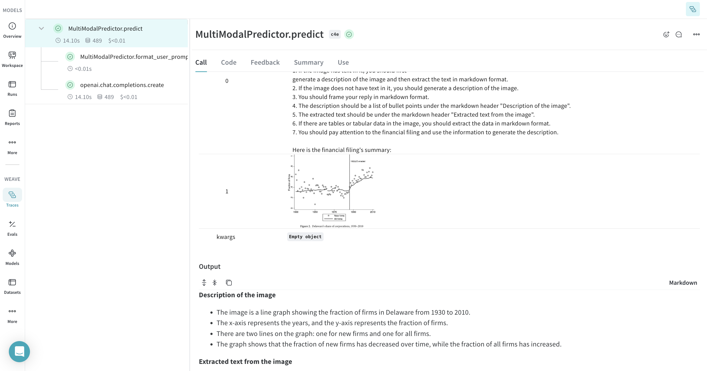

# Multi-modal RAG for Finance

A simple RAG (Retrieval-Augmented Generation) system for question-answering on [Tesla's](https://www.tesla.com/) financial filing gathered from the [SEC-EDGAR Database](https://www.sec.gov/edgar) by the [US Securities and Exchange Comission](https://www.sec.gov/). This codebase is closely inspired by the materials from the free course [RAG++ : From POC to Production](https://www.wandb.courses/courses/rag-in-production).

The codebase demonstrates how to build multi-modal RAG pipelines for question-answering systems and other downstream tasks in the finance domain using [Llama3.2 Vision](https://huggingface.co/meta-llama/Llama-3.2-90B-Vision). The codebase is also tightly integrated with [Weave](https://weave-docs.wandb.ai/), a lightweight toolkit for tracking and evaluating LLM applications, built by Weights & Biases. You cam explore all the traces and datasets used in this project at [geekyrakshit/finance_multi_modal_rag](https://wandb.ai/geekyrakshit/finance_multi_modal_rag).

## Installation

Install dependencies using the following commands:

```bash
git clone https://github.com/wandb/rag
cd rag/finance_multi_modal_rag
pip install -U pip uv
uv pip install torch --index-url https://download.pytorch.org/whl/cpu
uv sync
```

Next, you need to activate the virtual environment:

```bash
source .venv/bin/activate
```

Finally, you need to get a Cohere API key (depending on which model you use).

## Usage

### Loading the Corpus

First, you need to create a corpus which acts as a source of truth for the RAG system. We do this by fetching the `10-Q` and the `DEF 14A` filings from the [Edgar database](https://www.sec.gov/edgar). Besides collecting the text, we also fetch all the images associated with the filings. In order to make it easy for chunking and indexing, we generate a comprehensive description corresponding to each image and extract all the text and tabular information using [meta-llama/Llama-3.2-90B-Vision-Instruct](https://huggingface.co/meta-llama/Llama-3.2-90B-Vision-Instruct).

We generate the image descriptions using a 2-stage prompting strategy:

First, we ask Llama-3.2 to summarize the text content in the filing document and extract some important keywords and observations.

||
|---|
|A weave trace corresponding to the summarization process|

Next, we pass this summary and set of extracted keyworkds from the text as context along with the images to Llama-90B-Vision-Instruct and ask it to generate descriptions of the image and extract all the text and tabular data in markdown format.

||
|---|
|A weave trace corresponding to the image description generation process|

You can use the following code to create your corpus by fetching filings from the [Edgar database](https://www.sec.gov/edgar) and generating the image descriptions. This creates a [Weave dataset](https://weave-docs.wandb.ai/guides/core-types/datasets) corresponding to the corpus.

```python
import weave
from edgar import set_identity

from finance_multi_modal_rag.data_loading import EdgarDataLoader
from finance_multi_modal_rag.llm_wrapper import MultiModalPredictor


def load_data(company_name: str, forms: list[str]):
    filings_data = []
    predictor = MultiModalPredictor(
        model_name="meta-llama/Llama-3.2-90B-Vision-Instruct-Turbo",
        base_url="http://195.242.25.198:8032/v1", # Replace with your base URL
    )
    for form in forms:
        filings_data += EdgarDataLoader(
            company_name=company_name, image_description_generator=predictor
        ).load_data(form)
    weave.publish(weave.Dataset(name=f"{company_name}_sec_filings", rows=filings_data))
    return filings_data


if __name__ == "__main__":
    set_identity("<YOUR-NAME> <YOUR-EMAIL-ID>")
    weave.init(project_name="finance_multi_modal_rag")
    load_data("TSLA", ["10-Q", "DEF 14A"])
```

The dataset generated by this code can be explored [here](https://wandb.ai/geekyrakshit/finance_multi_modal_rag/weave/objects/TSLA_sec_filings/versions/KstNUWdhbkXklGkiMoQZN37rxpMHUQhMb1dE2Ys6AIw).

### Indexing our Corpus

Next, we are going split the text from corpus dataset into smaller chunks. We do this to:

- only send the data that is required for generation reducing the input token cost
- the limited context allows the LLM to not miss on details we want the generation to have

We are going to use the **Semantic Chunking** strategy described in chapter 3 of the free course [RAG++ : From POC to Production](https://www.wandb.courses/courses/rag-in-production). Simply speaking, we are going to split the text into sentences which we will group into chunks using semantic similarity.

You can run the following code to compute the chunks along with the corresponding metadat and store them in a Weave dataset.

```python
import weave
from dotenv import load_dotenv

from finance_multi_modal_rag.chunking import chunk_documents

load_dotenv()

weave.init(project_name="finance_multi_modal_rag")
chunk_documents(
    source_dataset_address="TSLA_sec_filings:v8",
    target_dataset_name="TSLA_sec_filings_chunks",
)
```

||
|---|
|A weave trace corresponding to the chunking process|

Next, we build the vector index consisting of the vecotor embeddings corresponding to the chunks encoded using [BAAI/bge-small-en-v1.5](https://huggingface.co/BAAI/bge-small-en-v1.5) and store persist the index locally using [safetensors](https://huggingface.co/docs/safetensors/en/index). The index is versioned using [W&B Artifacts](https://docs.wandb.ai/guides/artifacts).

```python
import weave
from dotenv import load_dotenv

import wandb
from finance_multi_modal_rag.retrieval import BGERetriever

load_dotenv()

weave.init(project_name="finance_multi_modal_rag")
wandb.init(project="finance_multi_modal_rag", job_type="upload")
retriever = BGERetriever(
    weave_chunked_dataset_address="TSLA_sec_filings_chunks:v1",
    model_name="BAAI/bge-small-en-v1.5",
)
retriever.create_index(index_persist_dir="./index", artifact_name="tsla-index")
```

### Retrieval and Generation

Finally, we can load back our vector index, retrive the `top_k` chunks and generate our responses using Llama-3.2.

||
|---|
|A weave trace corresponding to the retrieval and generation process|

```python
import weave
from dotenv import load_dotenv

from finance_multi_modal_rag.llm_wrapper import MultiModalPredictor
from finance_multi_modal_rag.response_generation import FinanceQABot
from finance_multi_modal_rag.retrieval import BGERetriever

load_dotenv()

weave.init(project_name="finance_multi_modal_rag")
retriever = BGERetriever.from_wandb_artifact(
    artifact_address="geekyrakshit/finance_multi_modal_rag/tsla-index:latest",
    weave_chunked_dataset_address="TSLA_sec_filings_chunks:v1",
    model_name="BAAI/bge-small-en-v1.5",
)
finace_qa_bot = FinanceQABot(
    predictor=MultiModalPredictor(
        model_name="meta-llama/Llama-3.2-90B-Vision-Instruct-Turbo",
        base_url="http://195.242.25.198:8032/v1", # Replace with your base URL
    ),
    retriever=retriever,
    weave_corpus_dataset_address="TSLA_sec_filings:v8",
)
finace_qa_bot.predict(query="what did elon say in the tweets that tesla reported?")
```
